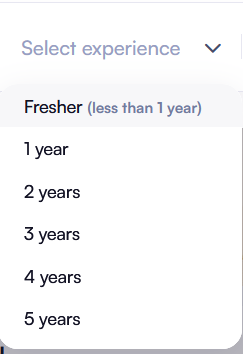

# Need's updation to proceed to next steps

I'm using DevTools in browser. I'm using the Elements tool to inspect an element. I will give you, below, the DOM structure where the element I am currenlty inspecting is located. I will provide the element itself and its ancestors, just like they appear in the DOM. I'll omit the rest of the DOM to keep it short. I need you to create an automation to login to https://www.naukri.com/ using the credentials in config I provide.And click on the search button. Search for the job in config

1. Go to Naukri.com and click login:

DOM structure:
`html
<body style="overflow: hidden;" class="element-copier-cursor">

</body>
`

CSS rules:
`css
/** For the <body style="overflow: hidden;" class="element-copier-cursor"> element **/
/* No stylesheet rules found for this element */

/** For the 
 element **/
/* No stylesheet rules found for this element */

/** For the 
 element **/
.nI-gNb-header, button, input {
  font-family: var(--font-family,"Satoshi");
  font-weight: 400;
}

.nI-gNb-header {
  -moz-box-orient: horizontal;
  -moz-box-direction: normal;
  -moz-box-flex: 0;
  -moz-box-pack: center;
  box-shadow: none;
  box-sizing: border-box;
  display: flex;
  flex-direction: row;
  flex-grow: 0;
  flex-shrink: 0;
  flex-wrap: nowrap;
  justify-content: center;
  left: 0px;
  min-width: 1200px;
  position: sticky;
  top: 0px;
  transition-property: box-shadow, box-shadow;
  transition-duration: 0.1s, 0.1s;
  transition-timing-function: ease-out, ease-out;
  transition-delay: 0s, 0s;
  transition-behavior: normal, normal;
  z-index: 99;
}

.nI-gNb-header, .nI-gNb-header .nI-gNb-header__placeholder {
  background-color: var(--N100,#fff);
  height: 72px;
}
/** For the 
 element **/
.nI-gNb-header__wrapper {
  box-sizing: border-box;
  display: flex;
  height: 100%;
  position: relative;
  width: 1120px;
}
/** For the 
 element **/
.nI-gNb-log-reg {
  opacity: 1;
  pointer-events: all;
  position: absolute;
  right: 148px;
  top: 15px;
  transition-property: opacity;
  transition-duration: 0.1s;
  transition-timing-function: ease-out;
  transition-behavior: normal;
  transition-delay: 0.25s;
}
/** For the <a title="Jobseeker Login" href="https://login.naukri.com/nLogin/Login.php" id="login_Layer" data-ga-track="Main Navigation Login|Login Icon" class="nI-gNb-lg-rg__login"> element **/
.nI-gNb-log-reg > a {
  -moz-box-align: center;
  align-items: center;
  border-top-left-radius: 50px;
  border-top-right-radius: 50px;
  border-bottom-right-radius: 50px;
  border-bottom-left-radius: 50px;
  box-sizing: border-box;
  cursor: pointer;
  display: inline-flex;
  font-size: 16px;
  font-weight: 700;
  line-height: 20px;
  outline-color: currentcolor;
  outline-style: none;
  outline-width: medium;
  padding-top: 10px;
  padding-right: 20px;
  padding-bottom: 10px;
  padding-left: 20px;
  text-decoration-color: currentcolor;
  text-decoration-line: none;
  text-decoration-style: solid;
  text-decoration-thickness: auto;
}

.nI-gNb-log-reg .nI-gNb-lg-rg__login {
  background-color: var(--N100,#fff);
  color: var(--P100,#275df5);
  height: 40px;
  width: 82px;
}

.nI-gNb-log-reg .nI-gNb-lg-rg__login:focus, .nI-gNb-log-reg .nI-gNb-lg-rg__login:hover {
  background-color: var(--N300,#f7f7f9);
}
`

Email input:

DOM structure:
`html
<body style="overflow: hidden;" class="element-copier-cursor">

<form autocomplete="on" name="login-form" class="form">
<input type="text" class="" maxlength="100" placeholder="Enter your active Email ID / Username" value=""></input>
</form>

</body>
`

CSS rules:
`css
/** For the <body style="overflow: hidden;" class="element-copier-cursor"> element **/
/* No stylesheet rules found for this element */

/** For the 
 element **/
/* No stylesheet rules found for this element */

/** For the 
 element **/
.nI-gNb-header, button, input {
  font-family: var(--font-family,"Satoshi");
  font-weight: 400;
}

.nI-gNb-header {
  -moz-box-orient: horizontal;
  -moz-box-direction: normal;
  -moz-box-flex: 0;
  -moz-box-pack: center;
  box-shadow: none;
  box-sizing: border-box;
  display: flex;
  flex-direction: row;
  flex-grow: 0;
  flex-shrink: 0;
  flex-wrap: nowrap;
  justify-content: center;
  left: 0px;
  min-width: 1200px;
  position: sticky;
  top: 0px;
  transition-property: box-shadow, box-shadow;
  transition-duration: 0.1s, 0.1s;
  transition-timing-function: ease-out, ease-out;
  transition-delay: 0s, 0s;
  transition-behavior: normal, normal;
  z-index: 99;
}

.nI-gNb-header, .nI-gNb-header .nI-gNb-header__placeholder {
  background-color: var(--N100,#fff);
  height: 72px;
}
/** For the 
 element **/
.nI-gNb-header__wrapper {
  box-sizing: border-box;
  display: flex;
  height: 100%;
  position: relative;
  width: 1120px;
}
/** For the 
 element **/
.nI-gNb-log-reg {
  opacity: 1;
  pointer-events: all;
  position: absolute;
  right: 148px;
  top: 15px;
  transition-property: opacity;
  transition-duration: 0.1s;
  transition-timing-function: ease-out;
  transition-behavior: normal;
  transition-delay: 0.25s;
}
/** For the 
 element **/
.naukri-drawer {
  position: fixed;
  top: 0px;
  width: var(--naukriDrawerWidth);
  z-index: 9999;
  height: 100%;
  transition-property: all;
  transition-duration: 0.2s;
  transition-timing-function: linear;
  transition-delay: 0s;
  transition-behavior: normal;
}

.naukri-drawer.right {
  right: calc(-1 * var(--naukriDrawerWidth));
}

.naukri-drawer.open.right {
  right: 0px;
}
/** For the 
 element **/
.naukri-drawer .drawer-wrapper {
  position: relative;
  background-color: rgb(255, 255, 255);
  background-position-x: 0%;
  background-position-y: 0%;
  background-repeat: repeat;
  background-attachment: scroll;
  background-image: none;
  background-size: auto;
  background-origin: padding-box;
  background-clip: border-box;
  height: 100vh;
  padding-top: 28px;
  padding-right: 81px;
  padding-bottom: 28px;
  padding-left: 24px;
  box-sizing: border-box;
  border-top-left-radius: 20px;
  border-top-right-radius: 0px;
  border-bottom-right-radius: 0px;
  border-bottom-left-radius: 20px;
}
/** For the 
 element **/
.naukri-drawer .drawer-wrapper > .login-layer {
  margin-top: initial;
  margin-right: initial;
  margin-bottom: initial;
  margin-left: initial;
  width: 410px;
}

.login-layer {
  background-color: rgb(255, 255, 255);
  width: 340px;
  margin-top: 0px;
  margin-right: 36px;
  margin-bottom: 0px;
  margin-left: 36px;
  padding-bottom: 30px;
  font-size: 11px;
}
/** For the <form autocomplete="on" name="login-form" class="form"> element **/
.naukri-drawer .drawer-wrapper > .login-layer form {
  margin-top: 30px;
}

.login-layer form {
  margin-top: 30px;
}
/** For the 
 element **/
.naukri-drawer .drawer-wrapper > .login-layer form .form-row {
  margin-bottom: 31px;
}

.login-layer form .form-row {
  width: 100%;
  margin-bottom: 30px;
  font-size: 12px;
  position: relative;
}
/** For the <input type="text" class="" maxlength="100" placeholder="Enter your active Email ID / Username" value=""> element **/
.nI-gNb-header, button, input {
  font-family: var(--font-family,"Satoshi");
  font-weight: 400;
}

.naukri-drawer .drawer-wrapper > .login-layer form .form-row input {
  border-top-left-radius: 16px;
  border-top-right-radius: 16px;
  border-bottom-right-radius: 16px;
  border-bottom-left-radius: 16px;
  color: var(--N800,#121224);
  font-size: 14px;
  font-weight: 500;
  height: 44px;
  line-height: 20px;
  padding-top: 12px;
  padding-right: 16px;
  padding-bottom: 12px;
  padding-left: 16px;
}

.login-layer input {
  font-size: 14px;
  line-height: 20px;
  border-top-left-radius: 2px;
  border-top-right-radius: 2px;
  border-bottom-right-radius: 2px;
  border-bottom-left-radius: 2px;
  border-top-width: 1px;
  border-top-style: solid;
  border-top-color: rgb(137, 147, 164);
  border-right-width: 1px;
  border-right-style: solid;
  border-right-color: rgb(137, 147, 164);
  border-bottom-width: 1px;
  border-bottom-style: solid;
  border-bottom-color: rgb(137, 147, 164);
  border-left-width: 1px;
  border-left-style: solid;
  border-left-color: rgb(137, 147, 164);
  border-image-outset: 0;
  border-image-repeat: stretch;
  border-image-slice: 100%;
  border-image-source: none;
  border-image-width: 1;
  padding-top: 8px;
  padding-right: 12px;
  padding-bottom: 8px;
  padding-left: 12px;
  width: 100%;
  outline-color: currentcolor;
  outline-style: none;
  outline-width: medium;
  box-sizing: border-box;
}
`

Password input:

DOM structure:
`html
<body style="overflow: hidden;" class="element-copier-cursor">

<form autocomplete="on" name="login-form" class="form">
<input autocomplete="off" type="password" class="" maxlength="40" placeholder="Enter your password"></input>
</form>

</body>
`

CSS rules:
`css
/** For the <body style="overflow: hidden;" class="element-copier-cursor"> element **/
/* No stylesheet rules found for this element */

/** For the 
 element **/
/* No stylesheet rules found for this element */

/** For the 
 element **/
.nI-gNb-header, button, input {
  font-family: var(--font-family,"Satoshi");
  font-weight: 400;
}

.nI-gNb-header {
  -moz-box-orient: horizontal;
  -moz-box-direction: normal;
  -moz-box-flex: 0;
  -moz-box-pack: center;
  box-shadow: none;
  box-sizing: border-box;
  display: flex;
  flex-direction: row;
  flex-grow: 0;
  flex-shrink: 0;
  flex-wrap: nowrap;
  justify-content: center;
  left: 0px;
  min-width: 1200px;
  position: sticky;
  top: 0px;
  transition-property: box-shadow, box-shadow;
  transition-duration: 0.1s, 0.1s;
  transition-timing-function: ease-out, ease-out;
  transition-delay: 0s, 0s;
  transition-behavior: normal, normal;
  z-index: 99;
}

.nI-gNb-header, .nI-gNb-header .nI-gNb-header__placeholder {
  background-color: var(--N100,#fff);
  height: 72px;
}
/** For the 
 element **/
.nI-gNb-header__wrapper {
  box-sizing: border-box;
  display: flex;
  height: 100%;
  position: relative;
  width: 1120px;
}
/** For the 
 element **/
.nI-gNb-log-reg {
  opacity: 1;
  pointer-events: all;
  position: absolute;
  right: 148px;
  top: 15px;
  transition-property: opacity;
  transition-duration: 0.1s;
  transition-timing-function: ease-out;
  transition-behavior: normal;
  transition-delay: 0.25s;
}
/** For the 
 element **/
.naukri-drawer {
  position: fixed;
  top: 0px;
  width: var(--naukriDrawerWidth);
  z-index: 9999;
  height: 100%;
  transition-property: all;
  transition-duration: 0.2s;
  transition-timing-function: linear;
  transition-delay: 0s;
  transition-behavior: normal;
}

.naukri-drawer.right {
  right: calc(-1 * var(--naukriDrawerWidth));
}

.naukri-drawer.open.right {
  right: 0px;
}
/** For the 
 element **/
.naukri-drawer .drawer-wrapper {
  position: relative;
  background-color: rgb(255, 255, 255);
  background-position-x: 0%;
  background-position-y: 0%;
  background-repeat: repeat;
  background-attachment: scroll;
  background-image: none;
  background-size: auto;
  background-origin: padding-box;
  background-clip: border-box;
  height: 100vh;
  padding-top: 28px;
  padding-right: 81px;
  padding-bottom: 28px;
  padding-left: 24px;
  box-sizing: border-box;
  border-top-left-radius: 20px;
  border-top-right-radius: 0px;
  border-bottom-right-radius: 0px;
  border-bottom-left-radius: 20px;
}
/** For the 
 element **/
.naukri-drawer .drawer-wrapper > .login-layer {
  margin-top: initial;
  margin-right: initial;
  margin-bottom: initial;
  margin-left: initial;
  width: 410px;
}

.login-layer {
  background-color: rgb(255, 255, 255);
  width: 340px;
  margin-top: 0px;
  margin-right: 36px;
  margin-bottom: 0px;
  margin-left: 36px;
  padding-bottom: 30px;
  font-size: 11px;
}
/** For the <form autocomplete="on" name="login-form" class="form"> element **/
.naukri-drawer .drawer-wrapper > .login-layer form {
  margin-top: 30px;
}

.login-layer form {
  margin-top: 30px;
}
/** For the 
 element **/
.naukri-drawer .drawer-wrapper > .login-layer form .form-row {
  margin-bottom: 31px;
}

.login-layer form .form-row {
  width: 100%;
  margin-bottom: 30px;
  font-size: 12px;
  position: relative;
}
/** For the <input autocomplete="off" type="password" class="" maxlength="40" placeholder="Enter your password"> element **/
.nI-gNb-header, button, input {
  font-family: var(--font-family,"Satoshi");
  font-weight: 400;
}

.naukri-drawer .drawer-wrapper > .login-layer form .form-row input {
  border-top-left-radius: 16px;
  border-top-right-radius: 16px;
  border-bottom-right-radius: 16px;
  border-bottom-left-radius: 16px;
  color: var(--N800,#121224);
  font-size: 14px;
  font-weight: 500;
  height: 44px;
  line-height: 20px;
  padding-top: 12px;
  padding-right: 16px;
  padding-bottom: 12px;
  padding-left: 16px;
}

.login-layer input {
  font-size: 14px;
  line-height: 20px;
  border-top-left-radius: 2px;
  border-top-right-radius: 2px;
  border-bottom-right-radius: 2px;
  border-bottom-left-radius: 2px;
  border-top-width: 1px;
  border-top-style: solid;
  border-top-color: rgb(137, 147, 164);
  border-right-width: 1px;
  border-right-style: solid;
  border-right-color: rgb(137, 147, 164);
  border-bottom-width: 1px;
  border-bottom-style: solid;
  border-bottom-color: rgb(137, 147, 164);
  border-left-width: 1px;
  border-left-style: solid;
  border-left-color: rgb(137, 147, 164);
  border-image-outset: 0;
  border-image-repeat: stretch;
  border-image-slice: 100%;
  border-image-source: none;
  border-image-width: 1;
  padding-top: 8px;
  padding-right: 12px;
  padding-bottom: 8px;
  padding-left: 12px;
  width: 100%;
  outline-color: currentcolor;
  outline-style: none;
  outline-width: medium;
  box-sizing: border-box;
}
`

Click Login Button:

DOM structure:
`html
<body style="overflow: hidden;" class="element-copier-cursor">

<form autocomplete="on" name="login-form" class="form">
<button type="submit" class="btn-primary loginButton"></button>
</form>

</body>
`

CSS rules:
`css
/** For the <body style="overflow: hidden;" class="element-copier-cursor"> element **/
/* No stylesheet rules found for this element */

/** For the 
 element **/
/* No stylesheet rules found for this element */

/** For the 
 element **/
.nI-gNb-header, button, input {
  font-family: var(--font-family,"Satoshi");
  font-weight: 400;
}

.nI-gNb-header {
  -moz-box-orient: horizontal;
  -moz-box-direction: normal;
  -moz-box-flex: 0;
  -moz-box-pack: center;
  box-shadow: none;
  box-sizing: border-box;
  display: flex;
  flex-direction: row;
  flex-grow: 0;
  flex-shrink: 0;
  flex-wrap: nowrap;
  justify-content: center;
  left: 0px;
  min-width: 1200px;
  position: sticky;
  top: 0px;
  transition-property: box-shadow, box-shadow;
  transition-duration: 0.1s, 0.1s;
  transition-timing-function: ease-out, ease-out;
  transition-delay: 0s, 0s;
  transition-behavior: normal, normal;
  z-index: 99;
}

.nI-gNb-header, .nI-gNb-header .nI-gNb-header__placeholder {
  background-color: var(--N100,#fff);
  height: 72px;
}
/** For the 
 element **/
.nI-gNb-header__wrapper {
  box-sizing: border-box;
  display: flex;
  height: 100%;
  position: relative;
  width: 1120px;
}
/** For the 
 element **/
.nI-gNb-log-reg {
  opacity: 1;
  pointer-events: all;
  position: absolute;
  right: 148px;
  top: 15px;
  transition-property: opacity;
  transition-duration: 0.1s;
  transition-timing-function: ease-out;
  transition-behavior: normal;
  transition-delay: 0.25s;
}
/** For the 
 element **/
.naukri-drawer {
  position: fixed;
  top: 0px;
  width: var(--naukriDrawerWidth);
  z-index: 9999;
  height: 100%;
  transition-property: all;
  transition-duration: 0.2s;
  transition-timing-function: linear;
  transition-delay: 0s;
  transition-behavior: normal;
}

.naukri-drawer.right {
  right: calc(-1 * var(--naukriDrawerWidth));
}

.naukri-drawer.open.right {
  right: 0px;
}
/** For the 
 element **/
.naukri-drawer .drawer-wrapper {
  position: relative;
  background-color: rgb(255, 255, 255);
  background-position-x: 0%;
  background-position-y: 0%;
  background-repeat: repeat;
  background-attachment: scroll;
  background-image: none;
  background-size: auto;
  background-origin: padding-box;
  background-clip: border-box;
  height: 100vh;
  padding-top: 28px;
  padding-right: 81px;
  padding-bottom: 28px;
  padding-left: 24px;
  box-sizing: border-box;
  border-top-left-radius: 20px;
  border-top-right-radius: 0px;
  border-bottom-right-radius: 0px;
  border-bottom-left-radius: 20px;
}
/** For the 
 element **/
.naukri-drawer .drawer-wrapper > .login-layer {
  margin-top: initial;
  margin-right: initial;
  margin-bottom: initial;
  margin-left: initial;
  width: 410px;
}

.login-layer {
  background-color: rgb(255, 255, 255);
  width: 340px;
  margin-top: 0px;
  margin-right: 36px;
  margin-bottom: 0px;
  margin-left: 36px;
  padding-bottom: 30px;
  font-size: 11px;
}
/** For the <form autocomplete="on" name="login-form" class="form"> element **/
.naukri-drawer .drawer-wrapper > .login-layer form {
  margin-top: 30px;
}

.login-layer form {
  margin-top: 30px;
}
/** For the 
 element **/
/* No stylesheet rules found for this element */

/** For the <button type="submit" class="btn-primary loginButton"> element **/
.nI-gNb-header, button, input {
  font-family: var(--font-family,"Satoshi");
  font-weight: 400;
}

.naukri-drawer .drawer-wrapper > .login-layer form .loginButton {
  border-top-left-radius: 60px;
  border-top-right-radius: 60px;
  border-bottom-right-radius: 60px;
  border-bottom-left-radius: 60px;
  color: var(--N100,#fff);
  font-size: 16px;
  font-weight: 700;
  height: 40px;
  line-height: 20px;
  margin-bottom: 0px;
  margin-top: 20px;
}

.naukri-drawer .drawer-wrapper > .login-layer form .btn-primary {
  box-shadow: none;
  padding-top: 9px;
  padding-right: 0px;
  padding-bottom: 11px;
  padding-left: 0px;
}

.login-layer .btn-primary {
  margin-top: 30px;
  text-transform: capitalize;
  width: 100%;
  display: inline-block;
  background-color: rgb(74, 144, 226);
  border-top-left-radius: 2px;
  border-top-right-radius: 2px;
  border-bottom-right-radius: 2px;
  border-bottom-left-radius: 2px;
  box-shadow: rgba(0, 0, 0, 0.2) 0px 2px 6px 0px;
  min-width: 123px;
  padding-top: 8px;
  padding-right: 16px;
  padding-bottom: 8px;
  padding-left: 16px;
  height: 36px;
  color: rgb(255, 255, 255);
  font-weight: 500;
  text-align: center;
  line-height: 18px;
  cursor: pointer;
  font-size: 14px;
  border-top-width: 0px;
  border-right-width: 0px;
  border-bottom-width: 0px;
  border-left-width: 0px;
}

.login-layer .loginButton {
  margin-bottom: 11px;
}
`

after login, automatically redirected here: https://www.naukri.com/mnjuser/homepage

Search toggle button:

DOM structure:
`html
<body class="element-copier-cursor" style="overflow-y: hidden;">

<input class="suggestor-input " placeholder="Enter keyword / designation / companies" tabindex="0" type="text" value=""></input>

<input id="experienceDD" spellcheck="false" autocomplete="off" title="" placeholder="Select experience" class="ddInput nonSearched" type="text" value="" name="experienceDD"></input>

<input class="suggestor-input " placeholder="Enter location" tabindex="0" type="text" value=""></input>

<button class="nI-gNb-sb__icon-wrapper" tabindex="0"></button>

</body>
`

CSS rules:
`css
/** For the <body class="element-copier-cursor" style="overflow-y: hidden;"> element **/
/* No stylesheet rules found for this element */

/** For the 
 element **/
.nI-gNb-header, button, input {
  font-family: var(--font-family,"Satoshi");
  font-weight: 400;
}

.nI-gNb-header {
  -moz-box-orient: horizontal;
  -moz-box-direction: normal;
  -moz-box-flex: 0;
  -moz-box-pack: center;
  box-shadow: none;
  box-sizing: border-box;
  display: flex;
  flex-direction: row;
  flex-grow: 0;
  flex-shrink: 0;
  flex-wrap: nowrap;
  justify-content: center;
  left: 0px;
  min-width: 1200px;
  position: sticky;
  top: 0px;
  transition-property: box-shadow, box-shadow;
  transition-duration: 0.1s, 0.1s;
  transition-timing-function: ease-out, ease-out;
  transition-delay: 0s, 0s;
  transition-behavior: normal, normal;
  z-index: 99;
}

.nI-gNb-header, .nI-gNb-header .nI-gNb-header__placeholder {
  background-color: var(--N100,#fff);
  height: 72px;
}
/** For the 
 element **/
.nI-gNb-header__wrapper {
  box-sizing: border-box;
  display: flex;
  height: 100%;
  position: relative;
  width: 1120px;
}
/** For the 
 element **/
.nI-gNb-search-bar {
  position: absolute;
  right: 373px;
  top: 15px;
}
/** For the 
 element **/
.nI-gNb-search-bar .nI-gNb-sb__main {
  -moz-box-align: center;
  align-items: center;
  background-color: var(--N100,#fff);
  border-top-left-radius: 40px;
  border-top-right-radius: 40px;
  border-bottom-right-radius: 40px;
  border-bottom-left-radius: 40px;
  box-shadow: var(--box-shadow1,0 6px 12px rgba(30,10,58,.04));
  box-sizing: border-box;
  cursor: pointer;
  display: inline-flex;
  height: 40px;
  overflow-x: hidden;
  overflow-y: hidden;
  position: absolute;
  right: 0px;
  top: 0px;
  transition-delay: 0.1s;
  transition-duration: 0.25s;
  transition-property: transform, right, top, width, height, -webkit-transform;
  transition-timing-function: ease-out;
  user-select: none;
  width: 228px;
}

.nI-gNb-search-bar .nI-gNb-sb__main--expand {
  cursor: default;
  height: 72px;
  overflow-x: initial;
  overflow-y: initial;
  transform: translate(274px, 54px);
  transition-delay: 0s;
  width: 880px;
}
`

Keyword, Designation, Company goes here:

DOM structure:
`html
<body style="overflow-y: hidden;" class="element-copier-cursor">

<input class="suggestor-input " placeholder="Enter keyword / designation / companies" tabindex="0" type="text" value=""></input>

</body>
`

CSS rules:
`css
/** For the <body style="overflow-y: hidden;" class="element-copier-cursor"> element **/
/* No stylesheet rules found for this element */

/** For the 
 element **/
.nI-gNb-header, button, input {
  font-family: var(--font-family,"Satoshi");
  font-weight: 400;
}

.nI-gNb-header {
  -moz-box-orient: horizontal;
  -moz-box-direction: normal;
  -moz-box-flex: 0;
  -moz-box-pack: center;
  box-shadow: none;
  box-sizing: border-box;
  display: flex;
  flex-direction: row;
  flex-grow: 0;
  flex-shrink: 0;
  flex-wrap: nowrap;
  justify-content: center;
  left: 0px;
  min-width: 1200px;
  position: sticky;
  top: 0px;
  transition-property: box-shadow, box-shadow;
  transition-duration: 0.1s, 0.1s;
  transition-timing-function: ease-out, ease-out;
  transition-delay: 0s, 0s;
  transition-behavior: normal, normal;
  z-index: 99;
}

.nI-gNb-header, .nI-gNb-header .nI-gNb-header__placeholder {
  background-color: var(--N100,#fff);
  height: 72px;
}
/** For the 
 element **/
.nI-gNb-header__wrapper {
  box-sizing: border-box;
  display: flex;
  height: 100%;
  position: relative;
  width: 1120px;
}
/** For the 
 element **/
.nI-gNb-search-bar {
  position: absolute;
  right: 373px;
  top: 15px;
}
/** For the 
 element **/
.nI-gNb-search-bar .nI-gNb-sb__main {
  -moz-box-align: center;
  align-items: center;
  background-color: var(--N100,#fff);
  border-top-left-radius: 40px;
  border-top-right-radius: 40px;
  border-bottom-right-radius: 40px;
  border-bottom-left-radius: 40px;
  box-shadow: var(--box-shadow1,0 6px 12px rgba(30,10,58,.04));
  box-sizing: border-box;
  cursor: pointer;
  display: inline-flex;
  height: 40px;
  overflow-x: hidden;
  overflow-y: hidden;
  position: absolute;
  right: 0px;
  top: 0px;
  transition-delay: 0.1s;
  transition-duration: 0.25s;
  transition-property: transform, right, top, width, height, -webkit-transform;
  transition-timing-function: ease-out;
  user-select: none;
  width: 228px;
}

.nI-gNb-search-bar .nI-gNb-sb__main--expand {
  cursor: default;
  height: 72px;
  overflow-x: initial;
  overflow-y: initial;
  transform: translate(274px, 54px);
  transition-delay: 0s;
  width: 880px;
}
/** For the 
 element **/
.nI-gNb-sb__full-view {
  -moz-box-align: center;
  align-items: center;
  display: flex;
  opacity: 0;
  pointer-events: none;
  position: absolute;
  transition-duration: 0.1s;
  transition-property: opacity;
  transition-timing-function: ease-out;
}

.nI-gNb-sb__full-view--expand {
  opacity: 1;
  pointer-events: all;
  transition-delay: 0.2s;
}
/** For the 
 element **/
.nI-gNb-sb__keywords {
  margin-left: 28px;
  margin-right: 20px;
  width: 295px;
}
/** For the 
 element **/
/* No stylesheet rules found for this element */

/** For the 
 element **/
.suggestor-wrapper {
  position: relative;
}
/** For the 
 element **/
.flex-row {
  display: flex;
}

.flex-wrap {
  flex-wrap: wrap;
}

.suggestor-wrapper.active .suggestor-box {
  border-top-color: rgb(0, 120, 219);
  border-right-color: rgb(0, 120, 219);
  border-bottom-color: rgb(0, 120, 219);
  border-left-color: rgb(0, 120, 219);
}

.suggestor-wrapper .suggestor-box {
  border-top-width: 1px;
  border-top-style: solid;
  border-top-color: rgb(219, 221, 230);
  border-right-width: 1px;
  border-right-style: solid;
  border-right-color: rgb(219, 221, 230);
  border-bottom-width: 1px;
  border-bottom-style: solid;
  border-bottom-color: rgb(219, 221, 230);
  border-left-width: 1px;
  border-left-style: solid;
  border-left-color: rgb(219, 221, 230);
  border-image-outset: 0;
  border-image-repeat: stretch;
  border-image-slice: 100%;
  border-image-source: none;
  border-image-width: 1;
  border-top-left-radius: 4px;
  border-top-right-radius: 4px;
  border-bottom-right-radius: 4px;
  border-bottom-left-radius: 4px;
  padding-top: 4px;
  padding-right: 12px;
  padding-bottom: 4px;
  padding-left: 12px;
  position: relative;
  width: 100%;
}

.nI-gNb-sugg .suggestor-wrapper .suggestor-box {
  border-top-width: medium;
  border-top-style: none;
  border-top-color: currentcolor;
  border-right-width: medium;
  border-right-style: none;
  border-right-color: currentcolor;
  border-bottom-width: medium;
  border-bottom-style: none;
  border-bottom-color: currentcolor;
  border-left-width: medium;
  border-left-style: none;
  border-left-color: currentcolor;
  border-image-outset: 0;
  border-image-repeat: stretch;
  border-image-slice: 100%;
  border-image-source: none;
  border-image-width: 1;
  box-sizing: border-box;
  height: 56px;
  padding-top: 0px;
  padding-right: 0px;
  padding-bottom: 0px;
  padding-left: 0px;
}
/** For the <input class="suggestor-input " placeholder="Enter keyword / designation / companies" tabindex="0" type="text" value=""> element **/
.nI-gNb-header, button, input {
  font-family: var(--font-family,"Satoshi");
  font-weight: 400;
}

.suggestor-wrapper .suggestor-box .suggestor-input {
  -moz-box-flex: 1;
  border-top-width: medium;
  border-top-style: none;
  border-top-color: currentcolor;
  border-right-width: medium;
  border-right-style: none;
  border-right-color: currentcolor;
  border-bottom-width: medium;
  border-bottom-style: none;
  border-bottom-color: currentcolor;
  border-left-width: medium;
  border-left-style: none;
  border-left-color: currentcolor;
  border-image-outset: 0;
  border-image-repeat: stretch;
  border-image-slice: 100%;
  border-image-source: none;
  border-image-width: 1;
  color: rgb(9, 30, 66);
  flex-grow: 1;
  font-size: 14px;
  font-weight: 500;
  line-height: 20px;
  min-width: 145px;
  padding-top: 8px;
  padding-right: 0px;
  padding-bottom: 8px;
  padding-left: 0px;
}

.suggestor-wrapper .suggestor-box .suggestor-input:active, .suggestor-wrapper .suggestor-box .suggestor-input:focus {
  outline-color: currentcolor;
  outline-style: none;
  outline-width: medium;
}

.nI-gNb-sugg .suggestor-wrapper .suggestor-box .suggestor-input {
  box-sizing: border-box;
  color: var(--N800,#121224);
  font-size: 16px;
  font-weight: 500;
  height: auto;
  line-height: 20px;
  margin-bottom: 0px;
  min-width: 80px;
  padding-top: 0px;
  padding-right: 0px;
  padding-bottom: 0px;
  padding-left: 0px;
}
`
Experience Selection Goes:

DOM structure:
`html
<body style="overflow-y: hidden;" class="element-copier-cursor">

<input id="experienceDD" spellcheck="false" autocomplete="off" title="" placeholder="Select experience" class="ddInput nonSearched" type="text" value="" name="experienceDD"></input>

</body>
`

CSS rules:
`css
/** For the <body style="overflow-y: hidden;" class="element-copier-cursor"> element **/
/* No stylesheet rules found for this element */

/** For the 
 element **/
.nI-gNb-header, button, input {
  font-family: var(--font-family,"Satoshi");
  font-weight: 400;
}

.nI-gNb-header {
  -moz-box-orient: horizontal;
  -moz-box-direction: normal;
  -moz-box-flex: 0;
  -moz-box-pack: center;
  box-shadow: none;
  box-sizing: border-box;
  display: flex;
  flex-direction: row;
  flex-grow: 0;
  flex-shrink: 0;
  flex-wrap: nowrap;
  justify-content: center;
  left: 0px;
  min-width: 1200px;
  position: sticky;
  top: 0px;
  transition-property: box-shadow, box-shadow;
  transition-duration: 0.1s, 0.1s;
  transition-timing-function: ease-out, ease-out;
  transition-delay: 0s, 0s;
  transition-behavior: normal, normal;
  z-index: 99;
}

.nI-gNb-header, .nI-gNb-header .nI-gNb-header__placeholder {
  background-color: var(--N100,#fff);
  height: 72px;
}
/** For the 
 element **/
.nI-gNb-header__wrapper {
  box-sizing: border-box;
  display: flex;
  height: 100%;
  position: relative;
  width: 1120px;
}
/** For the 
 element **/
.nI-gNb-search-bar {
  position: absolute;
  right: 373px;
  top: 15px;
}
/** For the 
 element **/
.nI-gNb-search-bar .nI-gNb-sb__main {
  -moz-box-align: center;
  align-items: center;
  background-color: var(--N100,#fff);
  border-top-left-radius: 40px;
  border-top-right-radius: 40px;
  border-bottom-right-radius: 40px;
  border-bottom-left-radius: 40px;
  box-shadow: var(--box-shadow1,0 6px 12px rgba(30,10,58,.04));
  box-sizing: border-box;
  cursor: pointer;
  display: inline-flex;
  height: 40px;
  overflow-x: hidden;
  overflow-y: hidden;
  position: absolute;
  right: 0px;
  top: 0px;
  transition-delay: 0.1s;
  transition-duration: 0.25s;
  transition-property: transform, right, top, width, height, -webkit-transform;
  transition-timing-function: ease-out;
  user-select: none;
  width: 228px;
}

.nI-gNb-search-bar .nI-gNb-sb__main--expand {
  cursor: default;
  height: 72px;
  overflow-x: initial;
  overflow-y: initial;
  transform: translate(274px, 54px);
  transition-delay: 0s;
  width: 880px;
}
/** For the 
 element **/
.nI-gNb-sb__full-view {
  -moz-box-align: center;
  align-items: center;
  display: flex;
  opacity: 0;
  pointer-events: none;
  position: absolute;
  transition-duration: 0.1s;
  transition-property: opacity;
  transition-timing-function: ease-out;
}

.nI-gNb-sb__full-view--expand {
  opacity: 1;
  pointer-events: all;
  transition-delay: 0.2s;
}
/** For the 
 element **/
.nI-gNb-sb__expDD {
  margin-right: 6px;
  margin-right: 6px;
}
/** For the 
 element **/
/* No stylesheet rules found for this element */

/** For the 
 element **/
.dropdownMainContainer {
  background-color: rgb(255, 255, 255);
  background-position-x: 0%;
  background-position-y: 0%;
  background-repeat: repeat;
  background-attachment: scroll;
  background-image: none;
  background-size: auto;
  background-origin: padding-box;
  background-clip: border-box;
  border-top-width: 1px;
  border-top-style: solid;
  border-top-color: rgb(220, 220, 220);
  border-right-width: 1px;
  border-right-style: solid;
  border-right-color: rgb(220, 220, 220);
  border-bottom-width: 1px;
  border-bottom-style: solid;
  border-bottom-color: rgb(220, 220, 220);
  border-left-width: 1px;
  border-left-style: solid;
  border-left-color: rgb(220, 220, 220);
  border-image-outset: 0;
  border-image-repeat: stretch;
  border-image-slice: 100%;
  border-image-source: none;
  border-image-width: 1;
  display: inline-block;
  min-height: 40px;
  min-width: 50px;
  padding-top: 6px;
  padding-right: 10px;
  padding-bottom: 6px;
  padding-left: 10px;
  position: relative;
  vertical-align: middle;
}

.dropdownMainContainer.focus {
  border-top-color: rgb(74, 144, 226);
  border-right-color: rgb(74, 144, 226);
  border-bottom-color: rgb(74, 144, 226);
  border-left-color: rgb(74, 144, 226);
}

.nI-gNb-dd .dropdownMainContainer {
  -moz-box-align: center;
  align-items: center;
  border-top-width: medium;
  border-top-style: none;
  border-top-color: currentcolor;
  border-right-width: medium;
  border-right-style: none;
  border-right-color: currentcolor;
  border-bottom-width: medium;
  border-bottom-style: none;
  border-bottom-color: currentcolor;
  border-left-width: medium;
  border-left-style: none;
  border-left-color: currentcolor;
  border-image-outset: 0;
  border-image-repeat: stretch;
  border-image-slice: 100%;
  border-image-source: none;
  border-image-width: 1;
  box-sizing: border-box;
  display: flex;
  margin-left: 0px;
  min-height: 0px;
  padding-top: 0px;
  padding-right: 0px;
  padding-bottom: 0px;
  padding-left: 0px;
  width: 170px;
}
/** For the <input id="experienceDD" spellcheck="false" autocomplete="off" title="" placeholder="Select experience" class="ddInput nonSearched" type="text" value="" name="experienceDD"> element **/
.nI-gNb-header, button, input {
  font-family: var(--font-family,"Satoshi");
  font-weight: 400;
}

.dropdownMainContainer input[type="text"] {
  border-top-width: medium;
  border-top-style: none;
  border-top-color: currentcolor;
  border-right-width: medium;
  border-right-style: none;
  border-right-color: currentcolor;
  border-bottom-width: medium;
  border-bottom-style: none;
  border-bottom-color: currentcolor;
  border-left-width: medium;
  border-left-style: none;
  border-left-color: currentcolor;
  border-image-outset: 0;
  border-image-repeat: stretch;
  border-image-slice: 100%;
  border-image-source: none;
  border-image-width: 1;
  box-sizing: border-box;
  color: rgb(0, 0, 0);
  margin-bottom: 0px;
  outline-color: currentcolor;
  outline-style: none;
  outline-width: medium;
  overflow-x: hidden;
  overflow-y: hidden;
  padding-top: 4px;
  padding-right: 20px;
  padding-bottom: 4px;
  padding-left: 0px;
  text-overflow: ellipsis;
  text-wrap-mode: nowrap;
  white-space-collapse: collapse;
}

.dropdownMainContainer input[type="text"]:focus {
  border-bottom-width: medium;
  border-bottom-style: none;
  border-bottom-color: currentcolor;
  box-shadow: none;
  outline-color: currentcolor;
  outline-style: none;
  outline-width: medium;
}

.dropdownMainContainer input[type="text"].nonSearched {
  color: transparent;
  text-shadow: rgb(0, 0, 0) 0px 0px 0px;
}

.dropdownMainContainer input[type="text"].nonSearched:focus {
  outline-color: currentcolor;
  outline-style: none;
  outline-width: medium;
}

.nI-gNb-dd .dropdownMainContainer > input[type="text"]:first-child {
  color: var(--N800,#121224);
  font-size: 16px;
  font-weight: 500;
  line-height: 20px;
  padding-top: 0px;
  padding-right: 0px;
  padding-bottom: 0px;
  padding-left: 0px;
  text-shadow: none;
  width: 100%;
}
`

Location:

DOM structure:
`html
<body style="overflow-y: hidden;" class="element-copier-cursor">

<input class="suggestor-input " placeholder="Enter location" tabindex="0" type="text" value=""></input>

</body>
`

CSS rules:
`css
/** For the <body style="overflow-y: hidden;" class="element-copier-cursor"> element **/
/* No stylesheet rules found for this element */

/** For the 
 element **/
.nI-gNb-header, button, input {
  font-family: var(--font-family,"Satoshi");
  font-weight: 400;
}

.nI-gNb-header {
  -moz-box-orient: horizontal;
  -moz-box-direction: normal;
  -moz-box-flex: 0;
  -moz-box-pack: center;
  box-shadow: none;
  box-sizing: border-box;
  display: flex;
  flex-direction: row;
  flex-grow: 0;
  flex-shrink: 0;
  flex-wrap: nowrap;
  justify-content: center;
  left: 0px;
  min-width: 1200px;
  position: sticky;
  top: 0px;
  transition-property: box-shadow, box-shadow;
  transition-duration: 0.1s, 0.1s;
  transition-timing-function: ease-out, ease-out;
  transition-delay: 0s, 0s;
  transition-behavior: normal, normal;
  z-index: 99;
}

.nI-gNb-header, .nI-gNb-header .nI-gNb-header__placeholder {
  background-color: var(--N100,#fff);
  height: 72px;
}
/** For the 
 element **/
.nI-gNb-header__wrapper {
  box-sizing: border-box;
  display: flex;
  height: 100%;
  position: relative;
  width: 1120px;
}
/** For the 
 element **/
.nI-gNb-search-bar {
  position: absolute;
  right: 373px;
  top: 15px;
}
/** For the 
 element **/
.nI-gNb-search-bar .nI-gNb-sb__main {
  -moz-box-align: center;
  align-items: center;
  background-color: var(--N100,#fff);
  border-top-left-radius: 40px;
  border-top-right-radius: 40px;
  border-bottom-right-radius: 40px;
  border-bottom-left-radius: 40px;
  box-shadow: var(--box-shadow1,0 6px 12px rgba(30,10,58,.04));
  box-sizing: border-box;
  cursor: pointer;
  display: inline-flex;
  height: 40px;
  overflow-x: hidden;
  overflow-y: hidden;
  position: absolute;
  right: 0px;
  top: 0px;
  transition-delay: 0.1s;
  transition-duration: 0.25s;
  transition-property: transform, right, top, width, height, -webkit-transform;
  transition-timing-function: ease-out;
  user-select: none;
  width: 228px;
}

.nI-gNb-search-bar .nI-gNb-sb__main--expand {
  cursor: default;
  height: 72px;
  overflow-x: initial;
  overflow-y: initial;
  transform: translate(274px, 54px);
  transition-delay: 0s;
  width: 880px;
}
/** For the 
 element **/
.nI-gNb-sb__full-view {
  -moz-box-align: center;
  align-items: center;
  display: flex;
  opacity: 0;
  pointer-events: none;
  position: absolute;
  transition-duration: 0.1s;
  transition-property: opacity;
  transition-timing-function: ease-out;
}

.nI-gNb-sb__full-view--expand {
  opacity: 1;
  pointer-events: all;
  transition-delay: 0.2s;
}
/** For the 
 element **/
.nI-gNb-sb__locations {
  width: 178px;
}
/** For the 
 element **/
/* No stylesheet rules found for this element */

/** For the 
 element **/
.suggestor-wrapper {
  position: relative;
}
/** For the 
 element **/
.flex-row {
  display: flex;
}

.flex-wrap {
  flex-wrap: wrap;
}

.suggestor-wrapper.active .suggestor-box {
  border-top-color: rgb(0, 120, 219);
  border-right-color: rgb(0, 120, 219);
  border-bottom-color: rgb(0, 120, 219);
  border-left-color: rgb(0, 120, 219);
}

.suggestor-wrapper .suggestor-box {
  border-top-width: 1px;
  border-top-style: solid;
  border-top-color: rgb(219, 221, 230);
  border-right-width: 1px;
  border-right-style: solid;
  border-right-color: rgb(219, 221, 230);
  border-bottom-width: 1px;
  border-bottom-style: solid;
  border-bottom-color: rgb(219, 221, 230);
  border-left-width: 1px;
  border-left-style: solid;
  border-left-color: rgb(219, 221, 230);
  border-image-outset: 0;
  border-image-repeat: stretch;
  border-image-slice: 100%;
  border-image-source: none;
  border-image-width: 1;
  border-top-left-radius: 4px;
  border-top-right-radius: 4px;
  border-bottom-right-radius: 4px;
  border-bottom-left-radius: 4px;
  padding-top: 4px;
  padding-right: 12px;
  padding-bottom: 4px;
  padding-left: 12px;
  position: relative;
  width: 100%;
}

.nI-gNb-sugg .suggestor-wrapper .suggestor-box {
  border-top-width: medium;
  border-top-style: none;
  border-top-color: currentcolor;
  border-right-width: medium;
  border-right-style: none;
  border-right-color: currentcolor;
  border-bottom-width: medium;
  border-bottom-style: none;
  border-bottom-color: currentcolor;
  border-left-width: medium;
  border-left-style: none;
  border-left-color: currentcolor;
  border-image-outset: 0;
  border-image-repeat: stretch;
  border-image-slice: 100%;
  border-image-source: none;
  border-image-width: 1;
  box-sizing: border-box;
  height: 56px;
  padding-top: 0px;
  padding-right: 0px;
  padding-bottom: 0px;
  padding-left: 0px;
}
/** For the <input class="suggestor-input " placeholder="Enter location" tabindex="0" type="text" value=""> element **/
.nI-gNb-header, button, input {
  font-family: var(--font-family,"Satoshi");
  font-weight: 400;
}

.suggestor-wrapper .suggestor-box .suggestor-input {
  -moz-box-flex: 1;
  border-top-width: medium;
  border-top-style: none;
  border-top-color: currentcolor;
  border-right-width: medium;
  border-right-style: none;
  border-right-color: currentcolor;
  border-bottom-width: medium;
  border-bottom-style: none;
  border-bottom-color: currentcolor;
  border-left-width: medium;
  border-left-style: none;
  border-left-color: currentcolor;
  border-image-outset: 0;
  border-image-repeat: stretch;
  border-image-slice: 100%;
  border-image-source: none;
  border-image-width: 1;
  color: rgb(9, 30, 66);
  flex-grow: 1;
  font-size: 14px;
  font-weight: 500;
  line-height: 20px;
  min-width: 145px;
  padding-top: 8px;
  padding-right: 0px;
  padding-bottom: 8px;
  padding-left: 0px;
}

.suggestor-wrapper .suggestor-box .suggestor-input:active, .suggestor-wrapper .suggestor-box .suggestor-input:focus {
  outline-color: currentcolor;
  outline-style: none;
  outline-width: medium;
}

.nI-gNb-sugg .suggestor-wrapper .suggestor-box .suggestor-input {
  box-sizing: border-box;
  color: var(--N800,#121224);
  font-size: 16px;
  font-weight: 500;
  height: auto;
  line-height: 20px;
  margin-bottom: 0px;
  min-width: 80px;
  padding-top: 0px;
  padding-right: 0px;
  padding-bottom: 0px;
  padding-left: 0px;
}
`

Search Button:

DOM structure:
`html
<body style="overflow-y: hidden;" class="element-copier-cursor">

<button class="nI-gNb-sb__icon-wrapper" tabindex="0"></button>

</body>
`

CSS rules:
`css
/** For the <body style="overflow-y: hidden;" class="element-copier-cursor"> element **/
/* No stylesheet rules found for this element */

/** For the 
 element **/
.nI-gNb-header, button, input {
  font-family: var(--font-family,"Satoshi");
  font-weight: 400;
}

.nI-gNb-header {
  -moz-box-orient: horizontal;
  -moz-box-direction: normal;
  -moz-box-flex: 0;
  -moz-box-pack: center;
  box-shadow: none;
  box-sizing: border-box;
  display: flex;
  flex-direction: row;
  flex-grow: 0;
  flex-shrink: 0;
  flex-wrap: nowrap;
  justify-content: center;
  left: 0px;
  min-width: 1200px;
  position: sticky;
  top: 0px;
  transition-property: box-shadow, box-shadow;
  transition-duration: 0.1s, 0.1s;
  transition-timing-function: ease-out, ease-out;
  transition-delay: 0s, 0s;
  transition-behavior: normal, normal;
  z-index: 99;
}

.nI-gNb-header, .nI-gNb-header .nI-gNb-header__placeholder {
  background-color: var(--N100,#fff);
  height: 72px;
}
/** For the 
 element **/
.nI-gNb-header__wrapper {
  box-sizing: border-box;
  display: flex;
  height: 100%;
  position: relative;
  width: 1120px;
}
/** For the 
 element **/
.nI-gNb-search-bar {
  position: absolute;
  right: 373px;
  top: 15px;
}
/** For the 
 element **/
.nI-gNb-search-bar .nI-gNb-sb__main {
  -moz-box-align: center;
  align-items: center;
  background-color: var(--N100,#fff);
  border-top-left-radius: 40px;
  border-top-right-radius: 40px;
  border-bottom-right-radius: 40px;
  border-bottom-left-radius: 40px;
  box-shadow: var(--box-shadow1,0 6px 12px rgba(30,10,58,.04));
  box-sizing: border-box;
  cursor: pointer;
  display: inline-flex;
  height: 40px;
  overflow-x: hidden;
  overflow-y: hidden;
  position: absolute;
  right: 0px;
  top: 0px;
  transition-delay: 0.1s;
  transition-duration: 0.25s;
  transition-property: transform, right, top, width, height, -webkit-transform;
  transition-timing-function: ease-out;
  user-select: none;
  width: 228px;
}

.nI-gNb-search-bar .nI-gNb-sb__main--expand {
  cursor: default;
  height: 72px;
  overflow-x: initial;
  overflow-y: initial;
  transform: translate(274px, 54px);
  transition-delay: 0s;
  width: 880px;
}
/** For the <button class="nI-gNb-sb__icon-wrapper" tabindex="0"> element **/
.nI-gNb-header, button, input {
  font-family: var(--font-family,"Satoshi");
  font-weight: 400;
}

.nI-gNb-search-bar .nI-gNb-sb__main .nI-gNb-sb__icon-wrapper {
  -moz-box-align: center;
  align-items: center;
  border-top-width: medium;
  border-top-style: none;
  border-top-color: currentcolor;
  border-right-width: medium;
  border-right-style: none;
  border-right-color: currentcolor;
  border-bottom-width: medium;
  border-bottom-style: none;
  border-bottom-color: currentcolor;
  border-left-width: medium;
  border-left-style: none;
  border-left-color: currentcolor;
  border-image-outset: 0;
  border-image-repeat: stretch;
  border-image-slice: 100%;
  border-image-source: none;
  border-image-width: 1;
  border-top-left-radius: 50%;
  border-top-right-radius: 50%;
  border-bottom-right-radius: 50%;
  border-bottom-left-radius: 50%;
  color: var(--N100,#fff);
  cursor: pointer;
  display: flex;
  font-size: 16px;
  height: 28px;
  margin-left: auto;
  margin-right: 6px;
  min-width: 28px;
  overflow-x: hidden;
  overflow-y: hidden;
  padding-top: 0px;
  padding-right: 0px;
  padding-bottom: 0px;
  padding-left: 0px;
  transition-delay: 0s;
  transition-duration: 0.15s;
  transition-property: min-width, width, height, margin, border-radius;
  transition-timing-function: ease-out;
  width: 28px;
}

.nI-gNb-search-bar .nI-gNb-sb__main--expand .nI-gNb-sb__icon-wrapper {
  border-top-left-radius: 60px;
  border-top-right-radius: 60px;
  border-bottom-right-radius: 60px;
  border-bottom-left-radius: 60px;
  font-size: 16px;
  font-weight: 700;
  height: 40px;
  line-height: 18px;
  margin-right: 16px;
  min-width: 97px;
  padding-left: 13px;
  transition-delay: 50ms;
  width: 97px;
}
`